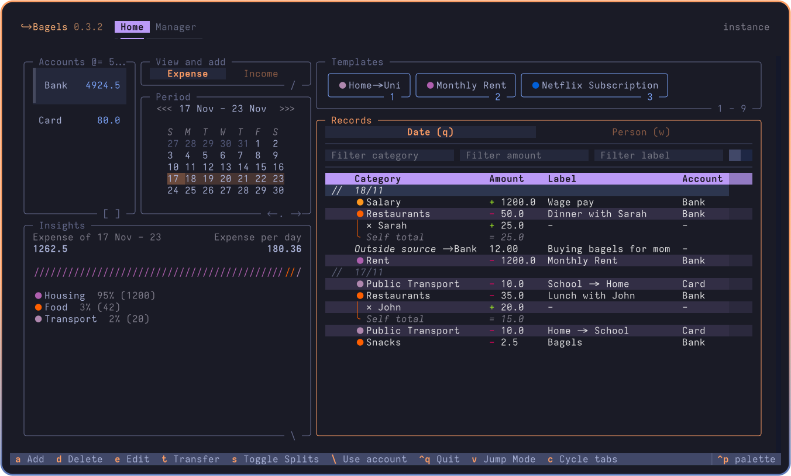
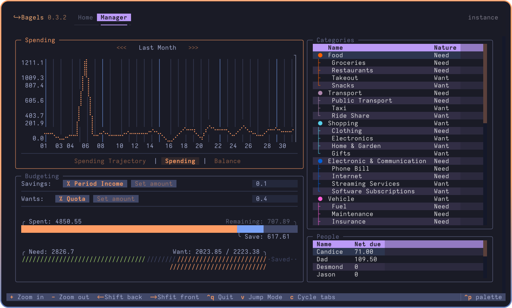

# 🥯 Bagels - TUI Expense Tracker

Powerful expense tracker that lives in your terminal.


<a title="This tool is Tool of The Week on Terminal Trove, The $HOME of all things in the terminal" href="https://terminaltrove.com/bagels"></a>




Bagels expense tracker is a TUI application where you can track and analyse your money flow, with convenience oriented features and a complete interface.

> **Why an expense tracker in the terminal?**
> I found it easier to build a habit and keep an accurate track of my expenses if I do it at the end of the day, instead of on the go. So why not in the terminal where it's fast, and I can keep all my data locally?

## ✨ Features

Some notable features include:

- Accounts, (Sub)Categories, Splits, Transfers, Records
- Templates for Recurring Transactions
- Add Templated Record with Number Keys
- Clear Table Layout with Togglable Splits
- Transfer to and from Outside Tracked Accounts
- "Jump Mode" Navigation
- Less and Less Fields to Enter per Transaction, Powered by Transactions and Input Modes
- Insights
- Customizable Keybindings and Defaults, such as First Day of Week
- Label, amount and category filtering
- Spending plottings / graphs with estimated spendings
- Budgetting tool for saving money and limiting unnecessary spendings

## 📦 Installation

<details open>
    <summary><b>Recommended: By UV</b></summary>

Bagels can be installed via uv on MacOS, Linux, and Windows.

`uv` is a single Rust binary that you can use to install Python apps. It's significantly faster than alternative tools, and will get you up and running with Bagels in seconds.

You don't even need to worry about installing Python yourself - uv will manage everything for you.

#### Unix / MacOS:

```bash
# install uv (package manager):
curl -LsSf https://astral.sh/uv/install.sh | sh

# restart your terminal, or run the following command:
source $HOME/.local/bin/env # or follow instructions

# install bagels through uv
uv tool install --python 3.13 bagels
```

`uv` can also be installed via Homebrew, Cargo, Winget, pipx, and more. See the [installation guide](https://docs.astral.sh/uv/getting-started/installation/) for more information.

Now you can run Posting via the command line:

#### Windows:

```bash
# install uv:
winget install --id=astral-sh.uv  -e
# then follow instructions to add uv to path
uv tool install --python 3.13 bagels
```

</details>

<details>
    <summary>By Pipx</summary>

    ```bash
    pipx install bagels
    ```

</details>

<details>
    <summary>By Conda</summary>

    ```bash
    conda install -c conda-forge bagels
    ```

</details>

## 🥯 Usage:

```bash
bagels # start bagels
bagels --at "./" # start bagels with data stored at cd
bagels locate database # find database file path
bagels locate config # find config file path
```

> It is recommended, but not required, to use "modern" terminals to run the app. MacOS users are recommended to use Ghostty, and Windows users are recommended to use Windows Terminal.

To upgrade with uv:

```bash
uv tool upgrade bagels
```

## 🛠️ Development setup

```sh
git clone https://github.com/EnhancedJax/Bagels.git
cd Bagels
uv run pre-commit install
mkdir instance
uv run bagels --at "./instance/" # runs app with storage in ./instance/
# alternatively, use textual dev mode to catch prints
uv run textual run --dev "./src/bagels/textualrun.py"
uv run textual console -x SYSTEM -x EVENT -x DEBUG -x INFO # for logging
```

Please use the black formatter to format the code.

## 🗺️ Roadmap

- [x] Budgets (Major!)
- [x] More insight displays and analysis (by nature etc.)
- [ ] Daily check-ins
- [ ] Pagination for records on monthly and yearly views.
- [ ] Importing from various formats

Backlog:

- [ ] "Processing" bool on records for transactions in process
- [ ] Record flags for future insights implementation
- [ ] Code review
- [ ] Repayment reminders
- [ ] Add tests
- [ ] Bank sync

## Attributions

- Heavily inspired by [posting](https://posting.sh/)
- Bagels is built with [textual](https://textual.textualize.io/)
- It's called bagels because I like bagels
